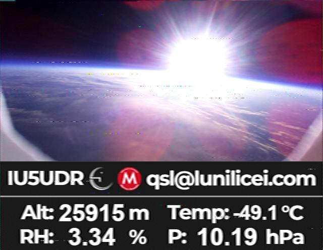

# Live-imgSSTV
RS41-SDE is a script developed as part of the LuniSpace project, a school initiative carried out by the Licei Lunigianesi high school that aims to launch weather radiosondes together with real-time image transmission systems.

After launching several image transmission systems, we decided to also use SSTV via rpitx, the software developed by F5OEO to transmit directly from a Raspberry Pi. During our first SSTV transmission, three test monoscopes were broadcast alternately. Subsequently, we decided to use this system to transmit images captured in real time. The idea came from the rpitx software itself; in fact, by overwriting the audio file in the directory set in rpitx, it is possible to automatically transmit images created on the spot. Live-imgSSTV allows you to create an image suitable for weather balloon launches using a real-time image and some meteorological data, all within a single graphic.

The script retrieves an image from a directory specified by the user. You can choose to enable a verification system within the script that uses timestamps to ensure the photo was taken properly. Next, `RS41-SDE` is executed—a script capable of retrieving meteorological data from a Vaisala RS41 radiosonde via a USB-TTL adapter connected to the Raspberry Pi (this script can also be downloaded from my GitHub page). Subsequently, the captured image and the data are inserted into a template. There is also a verification system for the data retrieved from the radiosonde; this ensures that even if there is an error in the captured image, the data, or both, the script can still generate a valid graphic in all cases. Within the template, there is a blank space where you can enter the callsign, an email address for QSLs, or any text the user wishes to add. You can also choose to save the image captured in real time to another directory; this allows you to save the image in its original resolution. In our case, we took 4K photos during the two launches, which we later retrieved and published. Finally, the script runs the `pysstv` library, which allows the newly created graphic to be converted into a .wav audio file ready for transmission in the SSTV mode set by the user.
#
This is an image of one of the two launches in which we used this script, broadcast in PD120 mode. The graphic shows the image captured in real time, the call sign assigned to the high school, the email address for QSLs, and the weather data retrieved from the radiosonde. 



# Requirements and Installation
The script is written in Python, so you need to verify that Python is installed on your system by running the command:
```bash
python --version
```
If Python is not installed, you will need to download and install it from the official website: https://www.python.org/downloads/
#
Next, you need to install the `pip` library, Python’s package manager, as it allows you to easily add all the necessary external libraries. In this case, in the next step we will install `pillow`, `pyserial`, and `pysstv`. You can download it and find installation instructions here: https://pip.pypa.io/en/stable/installation/ 
#
Next, you need to install the pillow, pyserial, and pysstv libraries. To install them, run this command:
```bash
pip install pillow pyserial pysstv
```
